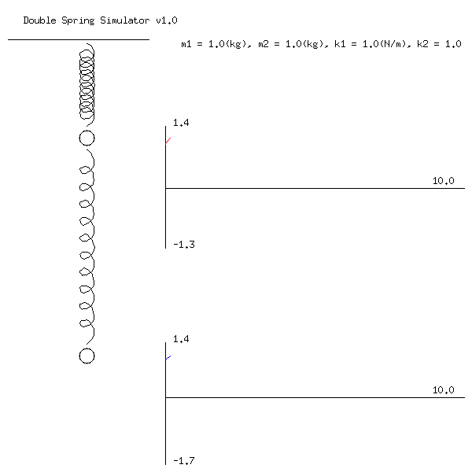

In assignment 4, we will simulate a spring motion. 
We will make a program that creates a gif file that simulates 
the oscillation of two springs with two masses, based on the inputs.

```
====================================
  @       This program simulates
  @ k1    the double spring motion
  @       modeled by two displacement
  m1      functions x1(t) and x2(t)
  @       over the interval [0, T]
  @ k2    Intial values are
  @       x1(0)=x0, x1'(0)=x1
  m2      x2(0)=x2, x2'(0)=x3
=====================================
Enter the value of m1: 1
Enter the value of m2: 1
Enter the value of k1: 1
Enter the value of k2: 1
Enter the value of x0: 1
Enter the value of x1: 1
Enter the value of x2: 1
Enter the value of x3: 1
Enter the value of T: 10
```

In `double/double.go` file, 
I already put code that simulates the double spring motion.
There is one function whose contents are missing.
* `FindSolution` in `/double/double.go`

This functions finds the exact solutions of 
the double spring motion based on the inputs.
Fill in the correct code,
and you will the following output as a result.


The file `./test.sh` is provided to compare the results of your output.
Note that it is executable only on a unix system.
The output of `./test.sh` will be stored in `double-test.gif`.